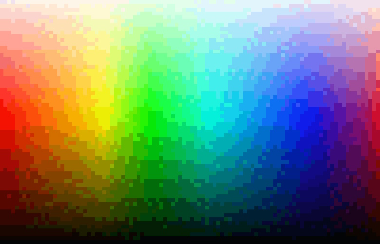

# How does the algorithm work?
Creating in-game pixel art from input images is a very interesting process. There are a lot of different materials to choose from when making your builds. You can even stack translucent blocks on top of solid blocks to multiply your color palette. Figuring out which color combinations are best can be a big challenge and it can take a LOT of time! Unless you have a tool for that. Pixel Stacker does exactly that. But how does it work? Let's dive in and find out.  

## 1. Reduce the size of the input image
Each pixel of the original image will need to be scanned and analyzed to figure out which in-game materials will produce the best match for that color. You should always downsize your art before beginning the process to achieve better results. Mostly because larger images are boring to look at. The program can still handle 8k images depending on your computer specs. But again, if you're making pixel art out of 8k images... I mean. Why? Can you even call it pixel art at that scale?

## 2. Reduce the color space to improve efficiency
Moving on. The best possible match for each input color will be cached for reuse. This is especially helpful if the number of unique colors in the image is not very high. There are a couple of ways to reduce the number of unique cache entries by reducing the total number of colors that need to be mapped.

### Flattening the colors
The image below shows the effects of flattening the color space in an image. On the left, the R (red) value is 255. On the right, it is 0. As you move from top to bottom, the level of flattening increases. Most people do not notice much of a difference between the first and second row. It is a difference between 255 unique values and 51 unique values though. This is just the red channel! If you perform this same operation on red, green, and blue channels, you can reduce the possibilities by 125x.  

### Quantizers can also help. 
Color quantization reduces the number of distinct colors of an image while keeping the new image visually similar to the original. Many different algorithms exist. Dithering can be used in this process as well.  

  

## 3. Map each pixel's color to a combination of in-game materials.
For each pixel in the input image, the program must determine the best possible material combination match from the list of accepted materials.  

### Which distance formula works the best?
To find the best color match you need to calculate which color in a set of options has the smallest "[color distance](https://en.wikipedia.org/wiki/Color_difference)" to your target color. There are a lot of ways to try and calculate "color distance". My own personal research had me looking into the [CIELAB](https://en.wikipedia.org/wiki/CIELAB_color_space) color space at one point which is a color space based on the human visible light spectrum. They use it to enhance photos in photo editing tools. The problem is that the equation to go from RGB to CIELAB is super long and involves a lot of slow math. Not ideal for my program.  

 

I also tried a regular euclidean distance algorithm using the RGB color space, but noticed a problem where it does not work well with saturation or hue differences. Basically, a desaturated color could be picked instead of a saturated color when our human eye thinks the saturated color is a better match. (I did not save any examples, unfortunately.) This was most noticed when trying to create pixel art of the green-clad video game character Link.

The solution is to adjust the algorithm to take hue into consideration as well. Where Δhue is a value between 0 and 180, we can adjust the formula to see hue as an important factor in distance. (Δ = delta) Hue is interesting because it is a value that exists on a circle rather than on a linear 0 to 255 scale. A value of 180 isn't necessarily high, it's just on that side of the circle.

Before: `distance^2 = (Δr)^2 + (Δg)^2 + (Δb)^2`  
After: `distance^2 = (Δr)^2 + (Δg)^2 + (Δb)^2 + sqrt(ΔHue * ΔHue * ΔHue)`

### What about materials with weird textures?
Performing a simple average color calculation doesn't work very well either. Look at the following textures. Some of the yellow/blue textures would have an average color that appears greenish. This is not ideal. To get around this, the individual pixels of each texture tile are compared using the distance formula to each pixel in the input image that is to be mapped. The total distance is then used to determine if the match is good or not.  

This is very slow. 16x16=256 pixels per material combination tile. Very expensive. Luckily, most textures use less than 4 unique colors. Create a frequency table for each unique color, and it becomes fast again.

## 4. Finally, the best possible match must be cached for re-use.
Which cache system works the best? A dictionary or hashmap would be the easiest solution if we only needed to find exact matches. A lot of times we want to know what the top 10 closest matches are though. It is not reasonable to search every material combination in the list to find a best match every time a new input color is experienced. 

To optimize this, the full list of available colors from the material combinations list is entered into a spatial [KDTree](https://en.wikipedia.org/wiki/K-d_tree) data structure. For efficiency, only the average color of each material combination tile is stored. The KDTree allows you to perform binary searches based on spatial coordinates. Red, green, and blue values are used as the axes of the data structure. Hue cannot be used as a dimension because hue operates in a circular loop. Luckily, it is still very cheap to just pull the closest 10 matches from the tree, and then perform the custom distance algorithm on those top 10 to find the true best match. The true best match is then stored in the dictionary cache of predetermined best matches. 

This provides a huge boost in efficiency. Instead of searching through each of the 5000+ combinations for a best match, you end up searching through only 15 or so combinations. The result is 99.127% accuracy, and a very good speed rating. This accuracy value can be increased by searching deeper into the list, but when mapping 255^3 unique colors to 5000 unique possibilities, you end up comparing black with 2% more black, and if the ordering of the two blacks is out of order, it is reported as an inaccurate. The differences reported are not impactful enough to be worth decreasing performance. Performance is preferred in this case, as the results are already stunning and beautiful. 

  
  
  

## 5. The results are provided to the program for rendering and display.
The algorithm for how larger images are displayed is a story for another day. For now I'll just say that the images are rendered to tiles because it is faster to access and update the memory for smaller image files than it is to access and update the memory for larger files. The C# framework also forbids images bigger than a certain size. 

In addition to tiling larger images, half-sized images are also produced to make it easier to render. If you are fully zoomed out on an 8000x4000 pixel input image, you do NOT want to see all (8000x16) x (4000x16) pixels of the rendered result. Rather than experience lag, you prefer to be able to see the image from a higher level so you can navigate to other areas of the picture. Right? That's where half-sized images come in. If the full sized set is too big, a half sized set is produced. If the half sized set is too big, a half size of the half size is produced. And so on, until each of the times are smaller than a certain size specified by the program. The great thing about this is that it improves how quickly the rendering occurs. Even better still is that the amount of memory consumed by this will never be more than 2x the original full sized image. 

## Conclusion
Now you know how it works.